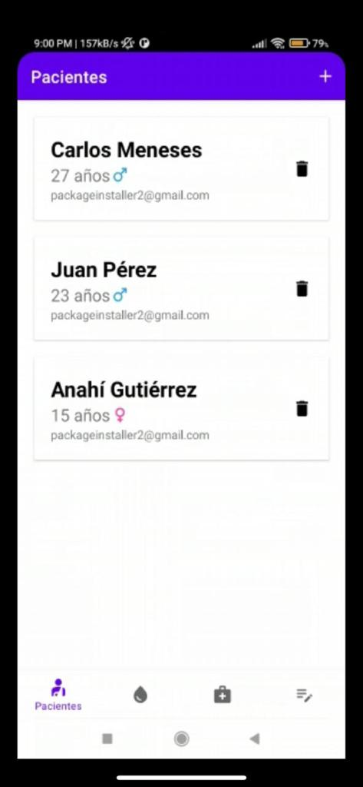
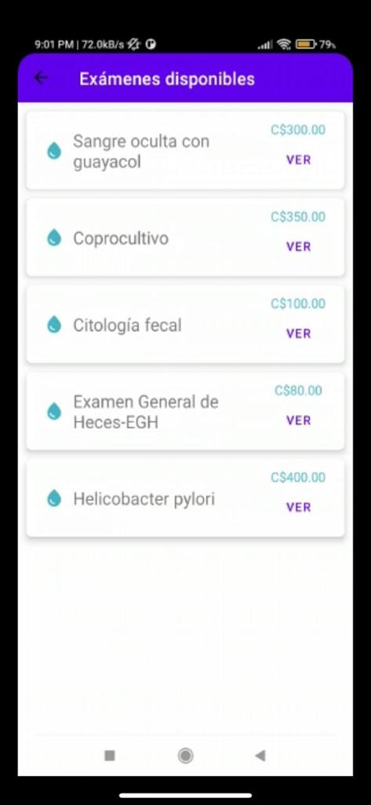
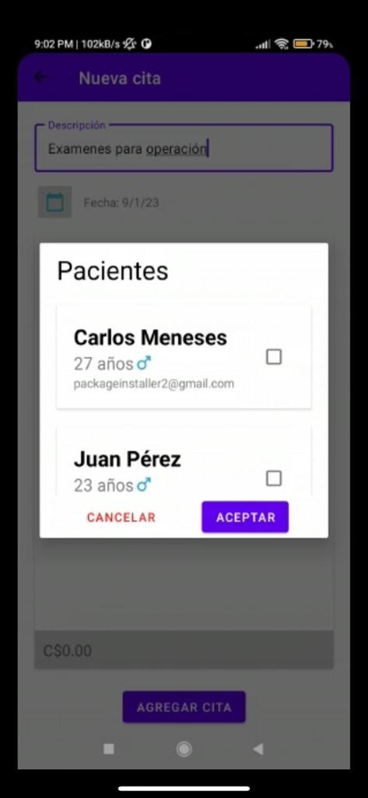
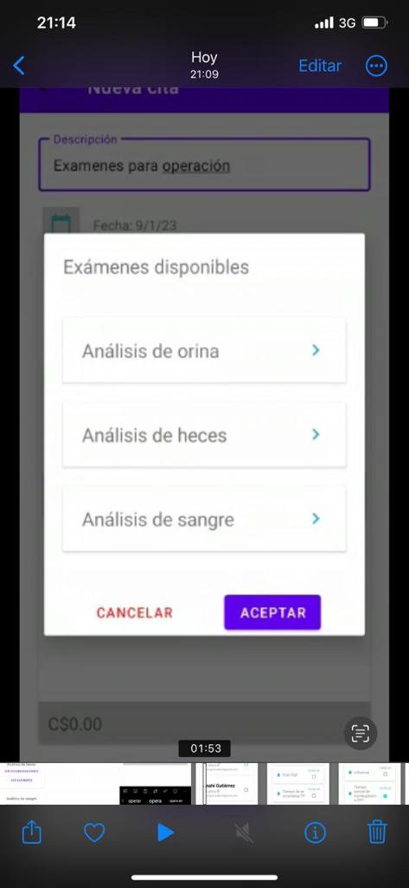
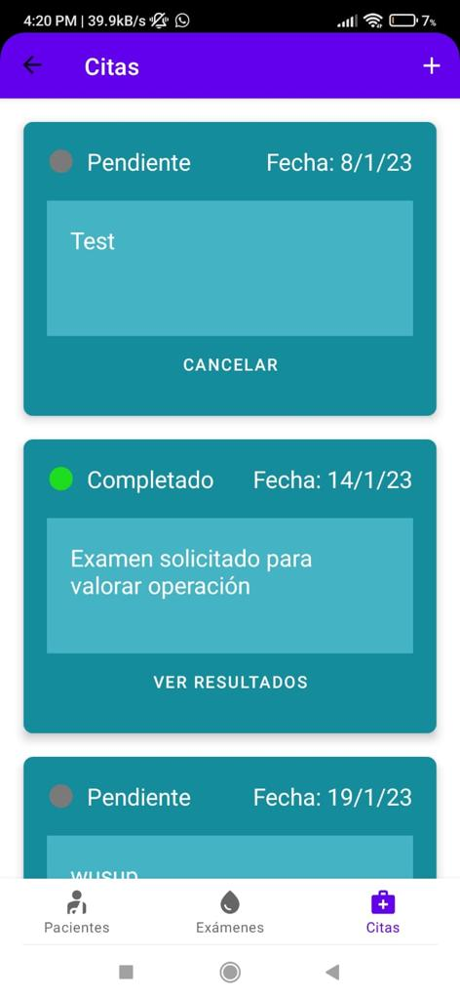

# Laboratorio Pro C 🔬
An application to list available laboratory tests, their prices and recommendations, and let customers submit appointments for them or a close relative.

## Why?
The lab needed a way to show the customers the different available laboratory tests with their respective categories and prices, they also needed a way to let the customer see how much would it cost and to place different orders using different registered patients.

#### ⚠️ Warning
the app only implemented required functionality, this was a college project requested by medical technology students so things like account creation or test results dispatching was not needed, meaning that any data created in the database will be available to every app instance connected to the same firebase database, you have to add your own `google-services.json` in order for the app to work.

## How to use
You can see the app screenshots in the app-screenshots folder.

The app lets the user add patients, this is  a crud so users can be created, listed, updated and deleted, the crud was implemented using bidirectional data binding.

### Why more than one patient?
The user may have children or any close relative that doesn't have a phone, by allowing a user to add multiple patients, being a children or not having a smartphone yourself is no longer a limitation.

---
The user can see the different lab categories, see the available exams and general recommendations for each category.

here are the general recommendations for the urine test

Here are the available test for feces

Tests can have specific recommendations which can be seen by pressing `see more` or `ver`, this means besides following general recommendations, you also have to follow specific recommendations if the test has any

you can set new appointments for different patients at the same time and they will be part of the same order, this is an empty appointment

you can select patients

and tests for each patient

you choose a date which will be either the current or later date

and this is how it looks with all the options used

the user will see the total for each patient and the total of the order which is the sum of the total of each patient.

after placing the order, the order can go through different states, the user will be able to see the different states of each order, the user can cancel the order only if is not being processed already, meaning the order is still pending

and finally the user can see the results for each order (not implemented as it was not required)
